# Perforce SCM plugin

Perforce is a client-server software configuration management (SCM) system, used to keep track of work done by developers. The server maintains a master file repository called `depot` using a database, which users interact through command-line and GUI clients. The clients communicate with the server, which is responsible for executing the commands, to serve up file content, run event triggers, and keep record of all of this in the database. The EC-Perforce plugin enables you to connect CloudBees CD/RO to Perforce. It calls the Perforce tool, `p4`, command line interface to pass in the user-provided parameters, enabling you to perform:

* Code checkout ('sync' in Perforce).
* Preflight builds.
* Continuous integration.
* Smart Sync: syncs a client and workspace to a pristine condition without need to download all the changes every time. This can be very useful if you have a large code base.

With this plugin, you can have different repository configurations, use the {PRODUCT} preflight capability, and schedule automated jobs through the CI Manager and Electric Sentry.

# Perforce links

For more information, visit the [Perforce website](http://www.perforce.com/perforce/technical.html/).

# Build

Run `./gradlew` to compile the plugin.

# CloudBees CD/RO integration to perforce

The plugin calls the Perforce tool `p4` command line and passes in the
user-provided parameters. You can perform code checkout (referred to as
"sync" in Perforce), preflight actions, and continuous integration.
Additionally, the **Smart Sync** feature is also included, which is not
in the native tool, that allows you to sync a client and workspace to a
pristine condition without downloading all the changes each time. This
is useful when you have a big code base.

With this plugin, you can have different repository configurations, use
CloudBees CD/RO Preflight capability, and schedule automated jobs
through the CloudBees CI Manager and Electric Sentry.

# Integrated version

This plugin was developed and tested against version 2014.1.

# Plugin procedures

For all parameter descriptions below, required parameters are shown in
Required. bold italics#.

# Plugin configuration

Plugin configurations are sets of parameters that apply across some or
all of the plugin procedures. They reduce repetition of common values,
create predefined sets of parameters for end users, and securely store
credentials where needed. Each configuration has a unique name that is
used in specific parameters on procedures.

To create plugin configurations, go to the Administration &gt; Source
Control page in CloudBees CD/RO. See the CloudBees CD/RO documentation
for more information about creating an SCM configuration.

## Create configuration

<table>
<colgroup>
<col style="width: 50%" />
<col style="width: 50%" />
</colgroup>
<thead>
<tr class="header">
<th style="text-align: left;">Parameter</th>
<th style="text-align: left;">Description</th>
</tr>
</thead>
<tbody>
<tr class="odd">
<td style="text-align: left;">
config
</td>
<td style="text-align: left;">
Unique name for the configuration.
Remember that you might need to create additional configurations over
time.
</td>
</tr>
<tr class="even">
<td style="text-align: left;">
credential
</td>
<td style="text-align: left;">
Username and password used in the
Perforce server that depends on P4PORT or P4HOST if you set it.
</td>
</tr>
<tr class="odd">
<td style="text-align: left;">
debug
</td>
<td style="text-align: left;">
Controls the output verbosity of the
commands. You can enter 1 to 5, with 1 for only generic messages and 5
for a full log.
</td>
</tr>
<tr class="even">
<td style="text-align: left;">
desc
</td>
<td style="text-align: left;">
Text description for your reference
only. Cloubees CD/RO does not use or interpret this
information.
</td>
</tr>
<tr class="odd">
<td style="text-align: left;">
P4CHARSET
</td>
<td style="text-align: left;">
Character set to translate of unicode
files. For example, utf8.
</td>
</tr>
<tr class="even">
<td style="text-align: left;">
P4COMMANDCHARSET
</td>
<td style="text-align: left;">
Character set to support UTF-16 and
UTF-32 character sets from the command-line client. For example,
utf16.
</td>
</tr>
<tr class="odd">
<td style="text-align: left;">
P4HOST
</td>
<td style="text-align: left;">
Overrides the real name of the Perforce
client machine so that the Perforce server treats the request as coming
from the specified client machine. For example,
workstation123.yourdomain.com.
</td>
</tr>
<tr class="even">
<td style="text-align: left;">
P4PORT(host:port)
</td>
<td style="text-align: left;">
Name of the Perforce server and the
port, separated by colon. For example, p4:3710.
</td>
</tr>
<tr class="odd">
<td style="text-align: left;">
P4TICKETS
</td>
<td style="text-align: left;">
Path to a ticket file for user
authentication. For example, /tickets/username/p4tickets.txt.
</td>
</tr>
</tbody>
</table>

# Plugin procedures

# Usage guidelines

-   When you want to run a preflight, use a Preflight procedure.

-   When you want to run a procedure other than Preflight, use the
    CheckoutCode procedure.

## CheckoutCode

This procedure downloads a working copy of the source tree to the agent
machine. It sets the client workspace and performs a sync command in the
desired destination. After the step is added to the procedure, the form
for configuring the step changes and shows the fields that apply to the
selected Source Type and Sync Type. For example, when you select a
Source Type (Client Template, Explicit View Spec, Branch, or Stream) and
a Sync Type (Standard Sync or Smart Sync), the form shows only the
fields that apply to the selected Source Type and Sync Type.

<table>
<colgroup>
<col style="width: 50%" />
<col style="width: 50%" />
</colgroup>
<thead>
<tr class="header">
<th style="text-align: left;">Parameter</th>
<th style="text-align: left;">Description</th>
</tr>
</thead>
<tbody>
<tr class="odd">
<td style="text-align: left;">
Source Type
</td>
<td style="text-align: left;">
Type of the repository source location
specification. (One of these selections is required).
</td>
</tr>
<tr class="even">
<td style="text-align: left;">
Client Template
</td>
<td style="text-align: left;">
(Only available with the <strong>Client
Template</strong> Source Type) Name of an existing Perforce Client
Specification, which specifies the files to retrieve. This option
creates a copy of the template client on the agent machine the first
time it is used. After that, the client may be retained or deleted
depending on other settings (see below). (Required)
</td>
</tr>
<tr class="odd">
<td style="text-align: left;">
Explicit View Spec
</td>
<td style="text-align: left;"><pre><code>Newline separated list of client &quot;view&quot; lines in the form &quot;depot;files&quot;. If you do not use this form, any specified client will be overridden, and a temporary client is created. Examples:</code></pre>
<ul>
<li>
<code>//depot/main/...;main/...\n//depot/sdk/...;sdk/...</code>
</li>
<li>
<code>//depot/main/... //tempclient/main/...</code>
</li>
<li>
<code>//depot/sdk/... //tempclient/sdk/...</code>
</li>
</ul>

Use the same syntax for client specification that Perforce uses.

</td>
</tr>
<tr class="even">
<td style="text-align: left;">
Branch
</td>
<td style="text-align: left;">
Depot path representing a branch.
Example:

<ul>
<li>
<code>//depot/path/to/branch/...</code>
</li>
</ul></td>
</tr>
<tr class="odd">
<td style="text-align: left;">
Stream
</td>
<td style="text-align: left;">
This stream will be used to create a
temporary client.
</td>
</tr>
<tr class="even">
<td style="text-align: left;">
Sync Type
</td>
<td style="text-align: left;">
Required. Type of the synchronization.
(One of these selections is required)#
</td>
</tr>
<tr class="odd">
<td style="text-align: left;">
Standard Sync
</td>
<td style="text-align: left;">
The procedure will perform a standard
incremental checkout ("p4 sync").
</td>
</tr>
<tr class="even">
<td style="text-align: left;">
Smart Sync
</td>
<td style="text-align: left;">
The procedure will perform Smart Sync
checkout. It will create a temporary client, using the destination
parameter as client root. This means that you don’t need to download all
the changes every time you run a checkout. This can have a significant
impact in performance, especially if you have a large source
tree.
</td>
</tr>
<tr class="odd">
<td style="text-align: left;">
Configuration
</td>
<td style="text-align: left;">
Name of the saved SCM configuration.
(Required)
</td>
</tr>
<tr class="even">
<td style="text-align: left;">
View
</td>
<td style="text-align: left;">
(Only available with the
<strong>Explicit View Spec</strong> Source Type) An explicit client view
specification to be used as the template for the temporary client. The
depot and file paths must be specified in standard view format. However,
the depot and file specification on each line must be separated by a
semicolon instead of a space.
</td>
</tr>
<tr class="odd">
<td style="text-align: left;">
allwrite
</td>
<td style="text-align: left;">
(Only available with the
<strong>Explicit View Spec</strong> Source Type) When selected, all
files in the workspace are writable. When not selected,, only the files
opened for edit are writable.
</td>
</tr>
<tr class="even">
<td style="text-align: left;">
clobber
</td>
<td style="text-align: left;">
(Only available with the
<strong>Explicit View Spec</strong> Source Type) When selected, any
writable, unopened files in your workspace can be overwritten when the
sync command is run. The affected files include files that were made
writable from using the <strong>allwrite</strong> option or when
permissions were manually changed from within the local operating
system. When not selected, (default), the files are not
overwritten.
</td>
</tr>
<tr class="odd">
<td style="text-align: left;">
compress
</td>
<td style="text-align: left;">
(Only available with the
<strong>Explicit View Spec</strong> Source Type) When selected, data is
sent between the client workspace and the Perforce server is compressed.
When not selected,, the data is not compressed.
</td>
</tr>
<tr class="even">
<td style="text-align: left;">
locked
</td>
<td style="text-align: left;">
(Only available with the
<strong>Explicit View Spec</strong> Source Type) When selected, only the
user in the Owner field in Perforce can use the workspace or edit the
client specification. When not selected,, anyone can use the workspace
or edit the client specification.
</td>
</tr>
<tr class="odd">
<td style="text-align: left;">
modtime
</td>
<td style="text-align: left;">
(Only available with the
<strong>Explicit View Spec</strong> Source Type) When selected, the
modification time of unopened files in your workspace shows when they
were submitted to the depot. When not selected, (default), the
modification time for the files in your workspace shows when they were
synced.
</td>
</tr>
<tr class="even">
<td style="text-align: left;">
rmdir
</td>
<td style="text-align: left;">
(Only available with the
<strong>Explicit View Spec</strong> Source Type) When not selected,
(default), a sync command that removes all files in a directory will
leave empty directories. When selected, the empty directories are
removed.
</td>
</tr>
<tr class="odd">
<td style="text-align: left;">
Unique Workspace Identifier
</td>
<td style="text-align: left;">
(Only available with the
<strong>Explicit View Spec</strong> Source Type) String used as a prefix
to make the new workspace name that is unique for the system. If this
parameter is changed after a prior run, the connection between the
previously created workspace and this sync operation will be broken and
a full sync runs.
</td>
</tr>
<tr class="even">
<td style="text-align: left;">
Workspace Name Postfix
</td>
<td style="text-align: left;">
(Only available with the <strong>Client
Template</strong> or <strong>Explicit View Spec</strong> Source Type)
String to append to the name of the workspace that will be
created.
</td>
</tr>
<tr class="odd">
<td style="text-align: left;">
Branch
</td>
<td style="text-align: left;">
(Only available with the
<strong>Branch</strong> Source Type.) An existing branch to use as the
template for the temporary client.
</td>
</tr>
<tr class="even">
<td style="text-align: left;">
Stream
</td>
<td style="text-align: left;">
(Only available with the
<strong>Branch</strong> Source Type.) An existing stream to use as the
template for the temporary client.
</td>
</tr>
<tr class="odd">
<td style="text-align: left;">
Destination directory
</td>
<td style="text-align: left;">
Location to which the source is checked
out. It must be an absolute path. It is required when Client Template,
Standard Sync, and Retain Client are selected.
</td>
</tr>
<tr class="even">
<td style="text-align: left;">
Changelist (or Label)
</td>
<td style="text-align: left;">
Changelist number or Perforce label to
get. Available values:

* A changelist number * A Perforce label * The string "have" that
uses the workspace "template" * Blank (no value), the default, which is
the most recent changelist
</td>
</tr>
<tr class="odd">
<td style="text-align: left;">
Last Snapshot
</td>
<td style="text-align: left;">
The first changelist to include in the
update log.
</td>
</tr>
<tr class="even">
<td style="text-align: left;">
Updates File
</td>
<td style="text-align: left;">
The name of a file to be written with
the text change comments for all changes included in this checkout since
the Last Snapshot.
</td>
</tr>
<tr class="odd">
<td style="text-align: left;">
Delete untracked files
</td>
<td style="text-align: left;">
During a Smart Sync, the plugin does
not delete files that are found in the Perforce repository.
</td>
</tr>
<tr class="even">
<td style="text-align: left;">
Forced Sync
</td>
<td style="text-align: left;">
Perforce does a full sync (using p4
sync -f) and copies every file in the View. This parameter is available
only when Standard Sync is selected.
</td>
</tr>
<tr class="odd">
<td style="text-align: left;">
Clean Local Workspace
</td>
<td style="text-align: left;">
Clean the local workspace and do a full
sync.
</td>
</tr>
<tr class="even">
<td style="text-align: left;">
Retain Client
</td>
<td style="text-align: left;">
(Only available with the <strong>Client
Template</strong> and <strong>Explicit View Spec</strong> Source Type.)
Keep template-based client after Checkout step completion in the sync.
See "CI Mode" example below.
</td>
</tr>
<tr class="odd">
<td style="text-align: left;">
Checkout Individual Files
</td>
<td style="text-align: left;">
(Only available with the
<strong>Explicit View Spec</strong> Source Type.) Check out specific
files instead of the entire directory.
</td>
</tr>
<tr class="even">
<td style="text-align: left;">
Automatic Ticket Login/Logout
</td>
<td style="text-align: left;">
The procedure uses the P4TICKETS
authentication form instead of the username and password. When your
perforce server is using the highest security level (ticket-based) this
plugin will not work at least you check this parameter.

</td>
</tr>
<tr class="odd">
<td style="text-align: left;">
Unshelve CLs
</td>
<td style="text-align: left;">
Enter a list of changelist numbers (one
per line) to unshelve.
</td>
</tr>
<tr class="even">
<td style="text-align: left;">
Report Only
</td>
<td style="text-align: left;">
When selected, the plugin does not
execute the sync operation. It actually does all of the changes and
updates calculations and then generates all the same reports and sends
the same emails as if the sync had been completed.
</td>
</tr>
</tbody>
</table>

This is the form for CheckoutCode:

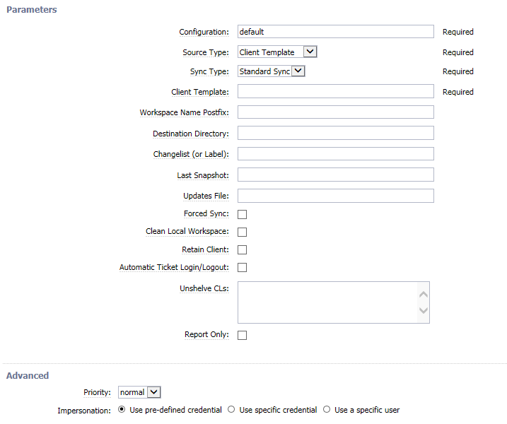

## Preflight (agent side)

This executes the agent side of the preflight.

<table>
<colgroup>
<col style="width: 50%" />
<col style="width: 50%" />
</colgroup>
<thead>
<tr class="header">
<th style="text-align: left;">Parameter</th>
<th style="text-align: left;">Description</th>
</tr>
</thead>
<tbody>
<tr class="odd">
<td style="text-align: left;">
config
</td>
<td style="text-align: left;">
Name of the saved SCM configuration.
(Required)
</td>
</tr>
<tr class="even">
<td style="text-align: left;">
deleteFiles
</td>
<td style="text-align: left;">
When selected, files used for Smart
Sync in the destination folder that are not in the depot will be
deleted. This works only when Smart Sync is selected.
</td>
</tr>
<tr class="odd">
<td style="text-align: left;">
dest
</td>
<td style="text-align: left;">
Destination directory for files that
must be an absolute path.
</td>
</tr>
<tr class="even">
<td style="text-align: left;">
incremental
</td>
<td style="text-align: left;">
If this is selected, the plugin runs
incremental preflights. It creates a temporary client with the
destination folder as client root and does an incremental sync, which
reverts all the open files in the client.
</td>
</tr>
<tr class="odd">
<td style="text-align: left;">
SmartSync
</td>
<td style="text-align: left;">
If this is selected, the plugin runs
<strong>SmartSync*preflights. It creates a temporary client with the
destination folder as client root and does a *SmartSync</strong>, so
that you do not need to download all the changes every time you run a
preflight or a checkout. This can have a performance impact in
performance if you have a big source tree.
</td>
</tr>
</tbody>
</table>

## Preflight (client side)

This will execute the client part of the preflight.

This parameters can be set in the .preflight file, or passed directly to
the ecclientpreflight tool.

<table>
<colgroup>
<col style="width: 50%" />
<col style="width: 50%" />
</colgroup>
<thead>
<tr class="header">
<th style="text-align: left;">Parameter</th>
<th style="text-align: left;">Description</th>
</tr>
</thead>
<tbody>
<tr class="odd">
<td style="text-align: left;">
p4port
</td>
<td style="text-align: left;">
The value of P4PORT. May also be set in
the environment or using p4 set.
</td>
</tr>
<tr class="even">
<td style="text-align: left;">
p4user
</td>
<td style="text-align: left;">
The value of P4USER. May also be set in
the environment or using p4 set.
</td>
</tr>
<tr class="odd">
<td style="text-align: left;">
p4passwd
</td>
<td style="text-align: left;">
The value of P4PASSWD. May also be set
in the environment or using p4 set.
</td>
</tr>
<tr class="even">
<td style="text-align: left;">
Required. p4client#
</td>
<td style="text-align: left;">
The value of P4CLIENT. May also be set
in the environment or using p4 set. (Required)
</td>
</tr>
<tr class="odd">
<td style="text-align: left;">
p4template
</td>
<td style="text-align: left;">
The name of a Perforce client used to
create a base snapshot before overlaying local changes. Defaults to the
value of --p4client if not specified, and if p4stream is also
blank.
</td>
</tr>
<tr class="even">
<td style="text-align: left;">
p4stream
</td>
<td style="text-align: left;">
The name of a Perforce stream used to
create a base snapshot before overlaying local changes.
</td>
</tr>
<tr class="odd">
<td style="text-align: left;">
p4changelist
</td>
<td style="text-align: left;">
The changelist number (or default)
whose changes are being tested. May be specified multiple times.

If no changelist are specified, all changelist for the client will be
tested.

You can also specify this parameter multiple times, in case you need
to run a preflight for several changelists.

i.e --p4changelist 13231 --p4changelist 54125
</td>
</tr>
<tr class="even">
<td style="text-align: left;">
p4synctochange
</td>
<td style="text-align: left;">
The changelist number that the
Preflight Job should use when syncing the source tree. Values are:

<ol type="1">
<li>
head: The most recent changelist anywhere in the P4 depot.
(Default).
</li>
<li>
have: The changelist of the most recent file that has been synced
to <em>p4client</em>
</li>
<li>
changelist: A p4 changelist number
</li>
</ol></td>
</tr>
</tbody>
</table>

Here is example of a preflight configuration file:

    <?xml version="1.0" encoding="utf-8"?>
    <data>
         <server>
             <userName>myuser</userName>
             <hostName>localhost</hostName>
         </server>
         <procedure>
             <projectName>MyProject</projectName>
             <procedureName>Master</procedureName>
             <parameter>
                <name>preFlight</name>
                <value>1</value>
             </parameter>
             <parameter>
                 <name>preFlightUser</name>
                 <value>myuser</value>
             </parameter>
             <jobTimeout>7200</jobTimeout>
         </procedure>
         <scm>
             <type>perforce</type>
             <port>p4:3710</port>
             <user>myuser</user>
             <client>myuser</client>
             <template>build-main</template>
         </scm>
    </data>

Please notice that the parameters inside the &lt;scm&gt; element are the
same as the Preflight client side parameters, but without "p4" at the
beginning. You can include the most common parameters in the file to
avoid typing them all the time.

## GetSCMTag

This procedure is used for Continuous Integration. This will monitor the
repository to discover whether something changed, and trigger a
pre-configured procedure.

<table>
<colgroup>
<col style="width: 50%" />
<col style="width: 50%" />
</colgroup>
<thead>
<tr class="header">
<th style="text-align: left;">Parameter</th>
<th style="text-align: left;">Description</th>
</tr>
</thead>
<tbody>
<tr class="odd">
<td style="text-align: left;">
autoLogin
</td>
<td style="text-align: left;">
Automatic Ticket Login/Logout. If this
is selected, the plugin uses the P4TICKETS authentication form instead
of the username and password.

When your perforce server is using the highest security level
(ticket-based), this plugin does not work unless you check this
parameter.

</td>
</tr>
<tr class="even">
<td style="text-align: left;">
config
</td>
<td style="text-align: left;">
Name of the saved SCM configuration.
(Required)
</td>
</tr>
<tr class="odd">
<td style="text-align: left;">
P4ClientOrDepot
</td>
<td style="text-align: left;">
The client or depot to monitor for CI
changes. This parameter can take several forms:

<ul>
<li>
Provide the name of in existing P4 client, and it will be
used.
</li>
</ul>

i.e. "myClient"

<pre><code>p4 -c myClient changes -t -m 1 //myClient/...</code></pre>
<ul>
<li>
Provide a single depot name (starting with //).
</li>
</ul>

i.e. "//myChanges"

<pre><code>p4 changes -t -m 1 //myChanges/...</code></pre>

A newline separated list of client "view" lines in the form
"depot;files". A temporary client will be created.

i.e.

<pre><code>//depot/main;main
//depot/sdk;sdk
//depot/main/... //tempclient/main/...
//depot/sdk/... //tempclient/sdk</code></pre>

If the Client or Depot is blank, the contents of Paths will be used
instead and the rules above will be applied.
</td>
</tr>
<tr class="even">
<td style="text-align: left;">
P4ExcludePaths
</td>
<td style="text-align: left;">
If Client or Depot is specified as view
lines, you can set exclusions.

For example:

<pre><code>//depot/tools/old;tools/old</code></pre>

This example creates the following lines in the temporary client
specification:

<pre><code>//depot/tools/old... //tempclient/tools/old/...</code></pre></td>
</tr>
<tr class="odd">
<td style="text-align: left;">
P4Paths
</td>
<td style="text-align: left;">
If Client or Depot is blank, a
temporary client is created and P4Paths is used as the specification for
the "view" lines.

For example:

<pre><code>//depot/main;main\n//depot/tools/sdk;tools/sdk</code></pre>

This example creates the following view lines:

<pre><code>//depot/main/... //tempclient/main/...
//depot/tools/sdk/... //tempclient/tools/sdk/...</code></pre></td>
</tr>
<tr class="even">
<td style="text-align: left;">
PreExcecutionCmd
</td>
<td style="text-align: left;">
Defines a series of command performed
before the plugin checks client (for example, dynamically generating a
clientspec).
</td>
</tr>
<tr class="odd">
<td style="text-align: left;">
Run Schedule Even if Another Instance
is Running
</td>
<td style="text-align: left;">
If checked, the schedule will be
launched even if the another instance of this schedule is already
running.
</td>
</tr>
</tbody>
</table>

This is the form for getSCMTag:

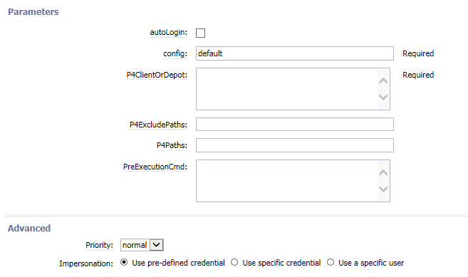

# UpdateLastGoodAndLastCompleted

If the job outcome is successful, the last successful snapshot property
is updated to the revision used in the job.

<table>
<colgroup>
<col style="width: 50%" />
<col style="width: 50%" />
</colgroup>
<thead>
<tr class="header">
<th style="text-align: left;">Parameter</th>
<th style="text-align: left;">Description</th>
</tr>
</thead>
<tbody>
<tr class="odd">
<td style="text-align: left;">
config
</td>
<td style="text-align: left;">
Name of the saved configuration.
(Required)
</td>
</tr>
</tbody>
</table>

# Examples and use cases

## Configure a checkout: CI mode configuration

This example has a step configuration referred to as the "CI Template
Mode" because it works with Continuous Integration. The Perforce client
is retained between builds on each separate agent machine so an
efficient incremental sync is performed instead of a full checkout each
time a job is run. The Perforce client uses a master template that can
be changed, and all clients using this template are updated
automatically without effecting the previous incremental syncs.

-   In Perforce, create a Client Specification (sometimes referred to as
    a Workspace) that is used as a template for CI builds with the same
    View specification across multiple machines. This template is copied
    to the agent machines the first time it is used.

In the template client do not specify a "Host" field in the Perforce
Client Specification. Specifying a host will cause an error if the
template is used on machines with different host names.

1.  Add a new Plugin-type step to the procedure. In the "New Plugin
    Step" pop-up, select the "Source Code Management" tab. From this
    pane, select the "Perforce - Checkout" procedure.

2.  Select **Client Template** as the Source Type and enter the name of
    the template client in the Client Template field. In this example,
    the template name is "ecardinal-pluginbase".

3.  Select "Standard Sync" as the Sync Type so only changed files will
    be downloaded. If you select "Smart Sync," more files than necessary
    may be downloaded. Smart Sync can be used when workspace files may
    have been altered by other people or processes and you want to
    restore the workspace to a pristine condition.

4.  Enter the name of a previously created Perforce SCM configuration
    (see the "Plugin Configuration" section). In this example, use a
    configuration called "p4".

5.  The "Destination Directory" must be an absolute directory on the
    agent machine (for example, C:\workspace) so that Perforce can
    accurately determine which files have changed. If a relative
    directory is used, the entire view is checked out for each job run.

6.  Put a check in the "Refresh Client from Template" box. This ensures
    that any changes to the base template in Perforce will be reflected
    in the clients on the actual agent machines. During the checkout,
    the workspace will be updated to reflect the template changes.

7.  Put a check in the "Retain Client" box. This keeps the client for
    the agent machine intact, allowing Perforce to determine which files
    need to be updated. If this is not checked, this procedure generates
    and use a temporary client, which will check out all files in the
    view for each job run. The temporary client will be deleted after
    the job is completed.

8.  Do not select "Forced Sync" for a CI Mode build. Perforce will force
    the checkout of all files in the view for each job run ("p4 sync
    -f"). This may be used in cases where a complete re-checkout of all
    files is desired, but this is not the normal case for CI type
    builds.

This mode is intended to be similar to a developer doing a basic "p4
sync" on the desktop and building against that workspace. Using this
mode implies that files generated in previous job runs are not removed,
and any files changed, added, or deleted locally in the workspace but
not submitted back to Perforce will not be updated by Perforce. If this
is problematic, use "Smart Sync" as the Sync Type. This does an
efficient cleaning up the workspace to restore it to a pristine
condition while the minimum number of files from the repository are
checked out.

The procedure now should look like this one, and you can run it now.

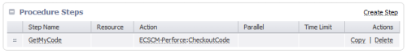

If everything was properly set now, you should see something like this.

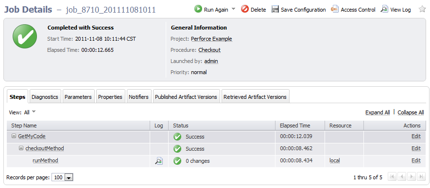

If you click on the log for the CheckOutMethod subprocedure "runMethod",
you will see something like this (the actual output depends on your
system configuration).

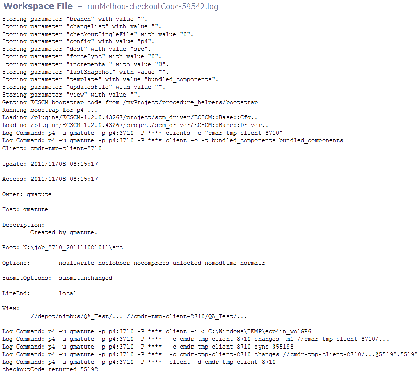

# Preflight

# Configuring the preflight

In the "New Plugin Step" pop-up, select the plugin, and then select the
"Source Code Management" tab. From this pane, select the "Perforce -
Preflight" procedure.

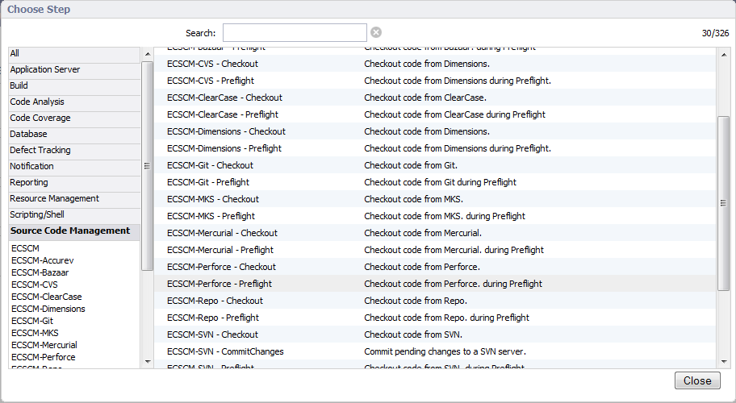

Select a step name. This example uses "PreflightStep." From the select
list, set the Perforce configuration that you want to use, and then
select a destination directory (an absolute path). To use the
incremental sync for preflight, put a check in the "incremental" box.
The parameter in the "dest" field is used for the sync every time.

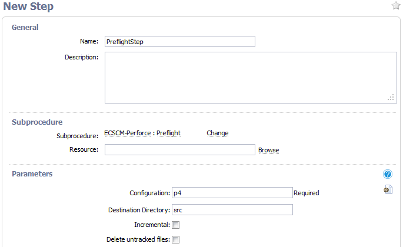

The procedure should look like this.

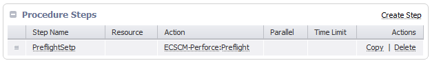

# Running the preflight

From the command line, use the "ecclientpreflight" tool to run a
preflight. This example uses the --p4changelist option to specify a
changelist with the preflight. If you do not specify one or more
changelists, the preflight uses all of them. The example also uses the
-c option to specify the configuration file called "sample.preflight".
When the file is named ".preflight" you do not need to specify a name.

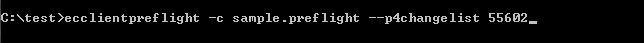

The "ecclientpreflight" tool asks for the password. The system then
copies all the files in the changelist to the server and runs the
preflight procedure that was created previously.

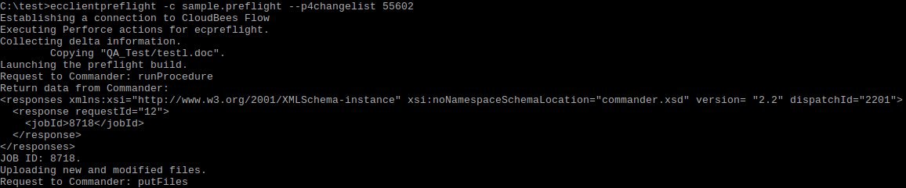

If you go to the CloudBees CD/RO Jobs tab, you see the job.

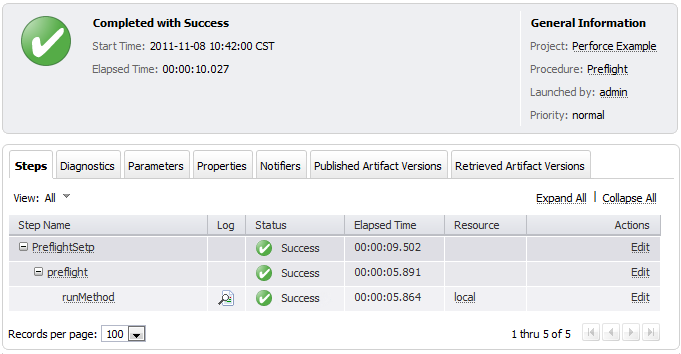

In the preflight step, you see the runMethod substep. Check the log for
this substep.

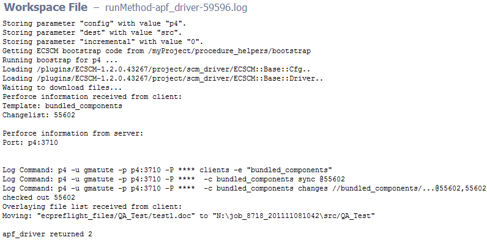

# Configuring an electric sentry schedule using the getSCMTag procedure

In the project, go to the Schedules tab, and then select the "SCM" type
in the pop-up list.

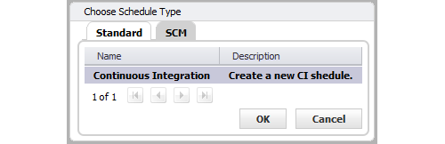

Select an step name and a Perforce configuration, and then select the
procedure that will run when the sentry is triggered. In this example,
the step is "Components-sentry", and the project is "Perforce Example",
the procedure inside the project is "runWithSentry", and this procedure
echoes a "hello world" message.

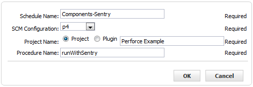

Enter information in the form to configure the sentry monitor with the
client monitor. In this example to monitor the client called
"bundled\_components", the sentry triggers the "runWithSentry" procedure
every time that someone submits a changelist.

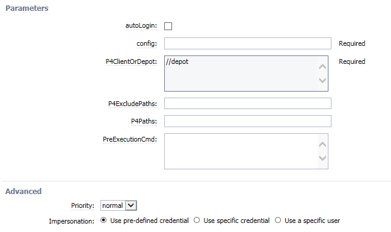

The schedule should look like this.

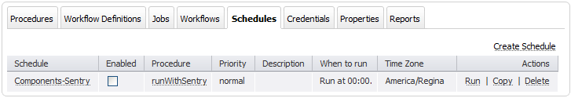

When something changes in the "bundled-components" client, the sentry
monitor shows something like this if you select the job from the Jobs
tab.

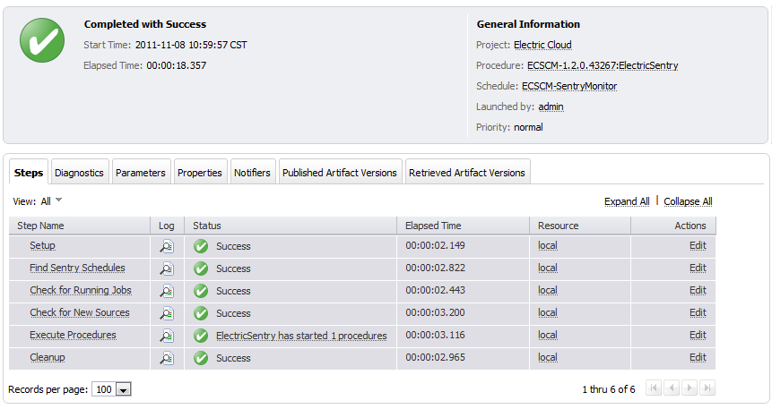

This is the log of the sentry monitor showing that a job was started by
the "Components-Sentry" schedule in the "Perforce Example" project.

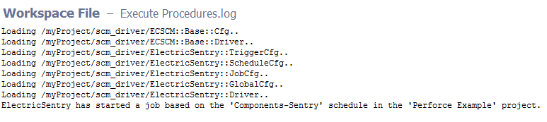

You can see the runWithSentry job in the Jobs tab.

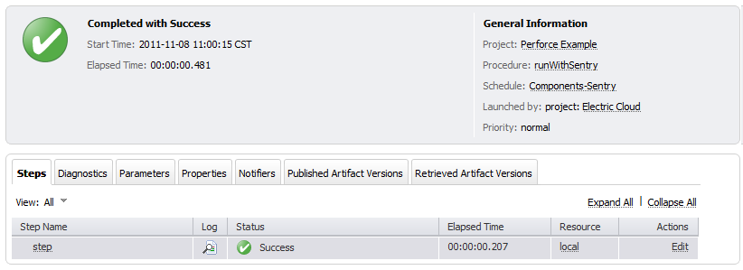

# Release notes

## ECSCM-Perforce 2.9.3

-   The documentation has been migrated to the main documentation site.
    (Deprecated.)

## ECSCM-Perforce 2.9.2

-   Renaming to "CloudBees CD/RO".

## ECSCM-Perforce 2.9.1

-   Renaming to "CloudBees".

## ECSCM-Perforce 2.9.0

-   Option **Run Schedule Even if Another Instance is Running** has been
    added for Sentry schedules.

-   The plugin icon has been updated.

## ECSCM-Perforce 2.8.6

-   Quiet Time bug in different timezones was fixed.

-   Build system was changed to gradle.

## ECSCM-Perforce 2.8.5

-   Improve debug output.

-   Fix checkout to specified **ChangeNumber** or **Label** with **Smart
    Sync**.

## ECSCM-Perforce 2.8.4

-   Make UTF-8 decoding non-strict in the plugin.

## ECSCM-Perforce 2.8.3

-   Don’t resolve labels to `ChangeNumber` in **CheckoutCode** step.

## ECSCM-Perforce 2.8.2

-   The return value of the call to `p4 submit` is checked when running
    preflight with `autoCommit` option.

-   Fix for `p4ExcludePaths` in Sentry routine.

## ECSCM-Perforce 2.8.1

-   Regression: `ecscm_snapshot` property sheet was not created during
    Checkout. ECSCM base plugin also needs to be upgraded to version
    2.2.6.

## ECSCM-Perforce 2.8.0

-   Fixed Changelog generation behavior. Updates File property is
    created at once with **Generate Changelog** checkbox.

-   Fixed UI issue with undefined state of checkbox for update from
    older plugin versions.

## ECSCM-Perforce 2.7.9

-   Revised the "Plugin Procedures" and the "Examples and Use Cases"
    section with the current parameters.

-   Fixed the bug when Smart Sync and the **Explicit View Spec** source
    type are specified on the CheckoutCode step.

## ECSCM-Perforce 2.7.8

-   Fixed incorrect changelog generation when user enters a label
    instead of changelist number.

-   Fixed the bug when Smart Sync and the **Explicit View Spec** source
    type are specified on the **CheckoutCode** step.

-   Added generate changelog option to **CheckoutCode** procedure, and
    restored the previous format of changelog (include *affected files*
    entries).

## ECSCM-Perforce 2.7.7

-   Added the parallel sync option to the **CheckoutCode** procedure.

-   Fixed the ElectricCommander behaviour when the **dest** parameter is
    not specified and the **Clean Local Workspace** parameter is
    selected.

## ECSCM-Perforce 2.7.6

-   Fix the bug where the **Perforce sync** does not work unshelved
    files.

-   Fix the **Latest Changelist retrieval** so that the plugin gets only
    submitted change lists.

-   Fix the performance issue with changelog generation. (The changelog
    will no longer show affected files.)

## ECSCM-Perforce 2.7.5

-   Fix the bug with **SmartSync**, and do not reset executable bit on
    checked out files.

-   Fix the bug with plugin crashing when the **Perforce Changelist** is
    specified in a **CheckOut** step.

-   Fix preflights with the **Incremental** option enabled.

## ECSCM-Perforce 2.7.4

-   Fix the bug with **SmartSync** and the delete untracked files in the
    CheckoutCode procedure. Untracked files were not getting deleted.

-   Fix the bug with **SmartSync** where the **incremental\_adds** file
    was not cleaned up after the **CheckoutProcedure** completed. The
    file is now deleted and has a random suffix.

## ECSCM-Perforce 2.7.3

-   Fix a typo in the parameter name for **Smart Sync** in the
    `ec_parameterForm` property.

-   Add the `-p` option to the `p4 sync` command to reduce the amount of
    time spent checking out code when a temporary client is being used.

## ECSCM-Perforce 2.5.3

-   Improve documentation about **P4tickets** authentication.

## ECSCM-Perforce 2.5.2

-   Fix on the regular expression that picks up files in order to
    include files that have the string *action* as part of their name.

## ECSCM-Perforce 2.5.1

-   **P4tickets** support added.

## ECSCM-Perforce 2.5.0

-   Automatic Ticket Login/Logout feature added.

## ECSCM-Perforce 2.4.0

-   New dynamic GUI configuration panel for Checkout procedure.

-   Addition of option to refresh template-based client during Checkout
    step initialization.

-   Addition of option to retain template-based client after Checkout
    step completion.

-   Error/Warning/Informational message cleanup.

-   Documentation cleanup.

## ECSCM-Perforce 2.3.0

-   The incremental sync is now called Smart Sync.

-   Incremental sync now perform a simple revert on the code.

## ECSCM-Perforce 2.2.1 - 2.2.3

-   Step chooser name cleanup

## ECSCM-Perforce 2.2.0

-   Added Stream support.

## ECSCM-Perforce 2.1.2

-   Added a changelog report.

-   The changelog now will work with the sentry schedules too.

## ECSCM-Perforce 2.0.14

-   Fix a problem with the incremental sync for reverted files.

## ECSCM-Perforce 2.0.7 to 2.0.12

-   Minor bug fixes. This versions weren’t released.

-   Support different client mappings for preflight.

# ECSCM-perforce2.0.6

-   Improve Incremental sync feature.

-   Support different client mappings for preflight.

## ECSCM-Perforce 2.0.5

-   Client parameter was deprecated, now all the client names will be
    generated by the plugin, this was in order to avoid corrupting
    existing clients by mistake.

-   Improve xml parameter panels.

-   New help page format.

## ECSCM-Perforce 2.0.0 to ecscm-perforce 2.0.4

-   These versions weren’t released to the public

## ECSCM-Perforce 1.1.19.43621

-   When the `incremental` checkbox is checked and client is empty, the
    procedure will create new temporal clients always and never delete
    them.

## ECSCM-Perforce 1.1.18.43597

-   Temporal clients are not deleted even if the incremental checkbox is
    not checked.

## ECSCM-Perforce 1.1.17.43430

-   If there’s no client name, assume that it’s a temporary client, and
    deleted it after using it.

## ECSCM-Perforce 1.1.16.43149

-   Add Incremental Sync checkbox and behavior.

## ECSCM-Perforce 1.1.15.41854

-   ecclientpreflight should provide a better error message when running
    a build with the \`default changelist, no description, and
    autocommit.

-   Preflight - Perforce client driver should treat
    `gDieOnWorkspaceChanges` as higher priority `gDieOnWorChanges`.

-   ecclientpreflight perforce client driver aborts with unresolved
    conflicts.

-   Use `$opts->{client}` in **getKeyFromTemplate** when
    `$opts->{template}` is not set.

-   Instead of adding a new parameter (checkoutSingleFile) to not add
    the `...` when is checked.

## ECSCM-Perforce 1.1.14.41620

-   Removing auto complete from the checkout view parameter.

## ECSCM-Perforce 1.1.13.41370

-   Fixing client query in order to use double quote instead of single
    quote.

## ECSCM-Perforce 1.1.12.41097

-   Incorrect behavior of `keep` flag.

-   Last snapshot produces incorrect changelist number.

-   Fix provide enhanced display of number of changes in synced.

-   Fix store list of user(s) who made changes.

-   Fix autocommit to match recent changes.

-   Don’t run the P4 query to determine the currently synced changelist
    if it is not needed.

## ECSCM-Perforce 1.1.11.40415

-   Provide enhanced display of number of changes and who made changes
    in the synced code.

-   Store list of user(s) who made changes in a property (presumably on
    the job step).

## ECSCM-Perforce 1.1.10.40175

-   Support Preflight based on **Sync to Have** rather than the normal
    **Sync to Head**.

-   Support Incremental Preflight.

-   Support Incremental Sync.

## ECSCM-Perforce 1.1.9.39549

-   Preflight updates, the agent can sync to a changelist other than the
    head.

-   Sentry priority does not default to `highest`.

## ECSCM-Perforce 1.1.8.39338

-   Continuous integration preexecution improvements.

## ECSCM-Perforce 1.1.7.39209

-   `C:` as the destination root for the Perforce plugin now works.

## ECSCM-Perforce 1.1.6.39038

-   Fixed a security issue.

## ECSCM-Perforce 1.1.5.38943

-   Handled undefined `$p4ExcludePaths` in `createP4ClientSpecFromView`.

## ECSCM-Perforce 1.1.4.38765

-   Changed code related to force sync checkbox change.

-   Added the p4 view to the checkout/sync editor.

-   Improved continuous integration preexecution.

-   Changed the keepClient option to a checkbox.

## ECSCM-Perforce 1.1.3.38446

-   Preexecution step is allowed.

-   Added restrictions on preflights with an invalid changelist.

## ECSCM-Perforce 1.1.2.38352

-   Added the force option to the sync command.

## ECSCM-Perforce 1.1.1.36678

-   SCM features - Sentry.

-   SCM features - Checkout.

-   SCM features - Preflight.

